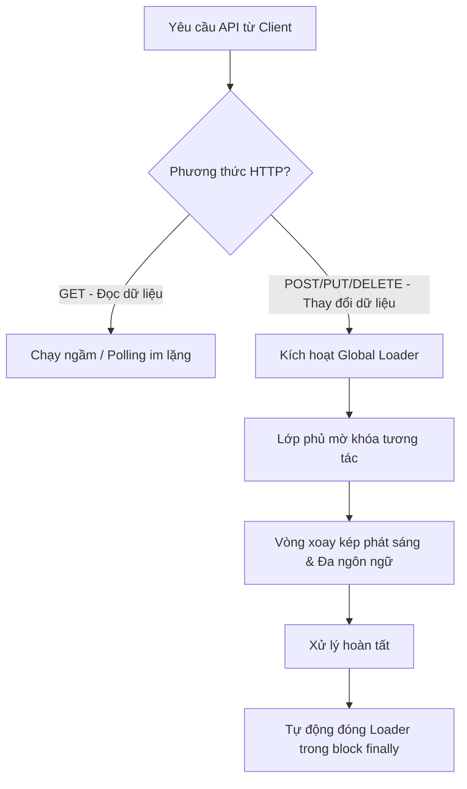

# Hướng dẫn Thiết kế UI/UX Loader Toàn cục (Global Loading System)

Tài liệu này trình bày chi tiết về triết lý thiết kế giao diện (UI), trải nghiệm người dùng (UX) và kiến trúc kỹ thuật của hệ thống màn hình tải dùng chung (Global Loading Overlay) được áp dụng trong dự án **Warehouse Access Control**.

---

## I. Triết lý Thiết kế UI/UX

Hệ thống Loader được thiết kế tuân thủ các quy tắc thẩm mỹ hiện đại, tạo cảm giác cao cấp (premium) và tối ưu hóa trải nghiệm tương tác thực tế của người dùng.



### 1. Thẩm mỹ kính mờ (Glassmorphism)
* **Lớp phủ nền (Backdrop)**: Sử dụng màu nền tối nhẹ `bg-slate-900/50` kết hợp hiệu ứng lọc mờ lớp sau `backdrop-blur-[3px]`. Hiệu ứng này tạo ra chiều sâu (depth perception) cho giao diện. Nó giúp người dùng nhận biết hệ thống đang bận nhưng vẫn thấy mờ nhạt các dữ liệu phía sau, tránh cảm giác bị ngắt quãng hoàn toàn.
* **Thẻ thông báo (Container Card)**: Thiết kế dạng một chiếc thẻ kính mờ bo tròn góc rộng `rounded-3xl` màu trắng đục `bg-white/95`, viền siêu mảnh màu xám mịn `border-slate-200/60`, đi kèm bóng đổ lớn `shadow-2xl`. Thẻ này gom cụm sự tập trung của người dùng vào trung tâm màn hình.

### 2. Bộ xoay vòng lặp kép phát sáng (Dual-ring Glowing Spinner)
Thay vì sử dụng các vòng xoay đơn sắc tẻ nhạt, loader sử dụng hệ thống xoay kép mang đậm nhận diện thương hiệu JIA HSIN:
* **Vòng ngoài**: Kích thước lớn (`w-12 h-12`), nét trung bình (`border-[3.5px]`), sử dụng màu xanh hoàng gia **Jia Hsin Royal Blue** (`primary`), xoay theo chiều kim đồng hồ (`animate-spin`).
* **Vòng trong**: Kích thước nhỏ (`w-8 h-8`), nét mỏng (`border-2`), sử dụng màu xanh bạc hà **Jia Hsin Mint Green** (`accent`), xoay **ngược chiều** kim đồng hồ (`animate-spin-reverse`).
* **Hiệu ứng phát sáng nền (Pulsing Glow)**: Sử dụng hiệu ứng `animate-ping` phát ra các xung nhịp nhẹ màu xanh dương nhạt (`bg-primary/10`) tỏa ra ngoài, tạo hiệu ứng "nhịp thở" sinh động cho loader.

### 3. Hiệu ứng vi chuyển động (Micro-animations)
* **Xuất hiện mềm mại**: Thẻ thông báo ở trung tâm không xuất hiện đột ngột mà được áp dụng hiệu ứng phóng to đàn hồi nhẹ `animate-scale-up` sử dụng hàm nội suy Bezier đặc biệt (`cubic-bezier(0.34, 1.56, 0.64, 1)`) trong vòng `0.26s`. Hiệu ứng này tạo cảm giác giao diện có sức sống và phản hồi tự nhiên.
* **Biến mất mượt mà**: Hiệu ứng chuyển cảnh mờ dần (`transition: opacity 0.22s ease-out`) khi đóng giúp chuyển đổi trạng thái nhẹ nhàng, không gây mỏi mắt cho người xem.

### 4. Bản dịch đa ngôn ngữ tự động (Auto Multi-language Support)
Loader tự động đọc ngôn ngữ hiện tại của hệ thống để hiển thị văn bản tương ứng mà lập trình viên không cần truyền tham số:
* **Tiếng Việt**: "Đang xử lý..." / "Vui lòng đợi trong giây lát"
* **English**: "Processing..." / "Please wait a moment"
* **中文 (Đài Loan)**: "處理中..." / "請稍候"
* Ngoài ra, hệ thống vẫn hỗ trợ ghi đè văn bản tùy chỉnh động cho các tác vụ đặc thù (ví dụ: *"Đang xuất file Excel..."*).

---

## II. Kiến trúc Lập trình & Áp dụng Thực tế

Hệ thống được thiết kế theo hướng module hóa, phân tách rõ ràng giữa Quản lý trạng thái (Store), Giao diện hiển thị (Component) và Tự động hóa kích hoạt (API Interceptor).

### 1. Trạng thái phản ứng toàn cục ([loading.store.js](file:///d:/source/repos/FGAM/WarehouseAccessWeb/src/stores/loading.store.js))
Sử dụng Vue 3 `reactive` và `readonly` để xây dựng một store siêu nhẹ, không phụ thuộc vào các thư viện ngoài phức tạp:
```javascript
import { reactive, readonly } from 'vue'

const state = reactive({
  isLoading: false,
  loadingText: ''
})

export function showLoading(text = '') {
  state.isLoading = true
  state.loadingText = text
}

export function hideLoading() {
  state.isLoading = false
  state.loadingText = ''
}

export function useLoadingState() {
  return readonly(state)
}
```

### 2. Giao diện toàn cục ([GlobalLoading.vue](file:///d:/source/repos/FGAM/WarehouseAccessWeb/src/components/common/GlobalLoading.vue))
Đăng ký thẻ hiển thị `<GlobalLoading />` trực tiếp tại tệp gốc **[App.vue](file:///d:/source/repos/FGAM/WarehouseAccessWeb/src/App.vue)** để luôn nằm trên cùng của tất cả các route và modal (`z-[9999]`).

### 3. Tự động kích hoạt thông minh tại Client API ([api-client.js](file:///d:/source/repos/FGAM/WarehouseAccessWeb/src/services/api/api-client.js))
Đây là điểm sáng về mặt kỹ thuật giúp tối ưu hóa trải nghiệm lập trình viên và người dùng:
* **Tự động chặn các tác vụ ghi/xóa (POST, PUT, DELETE)**: Các tác vụ này trực tiếp làm thay đổi dữ liệu máy chủ (như Đăng nhập, Check-in, Lưu cấu hình, Xóa người dùng). Hệ thống tự động kích hoạt `showLoading()` để khóa màn hình, ngăn chặn triệt để hiện tượng người dùng click đúp (double-click) gửi trùng yêu cầu lên server.
* **Tự động giải phóng trong `finally`**: Màn hình tải được cam kết luôn đóng khi có phản hồi từ Server (kể cả thành công hay lỗi).
* **Im lặng đối với tác vụ đọc (GET)**: Các tác vụ lấy dữ liệu hoặc tự động cập nhật ngầm định kỳ (như tải danh sách monitor mỗi 3 giây hay chạy chữ Whitelist mỗi 10 giây) sẽ chạy im lặng ở chế độ nền. Điều này giúp hệ thống cập nhật liên tục mà **không bao giờ chặn màn hình của người dùng**.
* **Cấu hình ghi đè**: Cung cấp tùy chọn `skipGlobalLoading: true` trong headers nếu có tác vụ POST/PUT/DELETE đặc biệt cần chạy ngầm.

```javascript
// Trích đoạn xử lý tự động trong api-client.js
const isMutative = ['POST', 'PUT', 'DELETE'].includes(options.method?.toUpperCase())
if (isMutative && !options.skipGlobalLoading) {
  showLoading()
}

try {
  const response = await fetch(...)
  return payload
} finally {
  if (isMutative && !options.skipGlobalLoading) {
    hideLoading()
  }
}
```

### 4. Áp dụng thủ công cho các tác vụ tải tệp (Export Excel)
Vì các tác vụ tải file Excel sử dụng trực tiếp hàm `fetch` gốc để lấy dữ liệu dạng nhị phân (`blob`), chúng được bao bọc thủ công bằng `showLoading()` và `hideLoading()` trực tiếp ở lớp Service ([master-data.service.js](file:///d:/source/repos/FGAM/WarehouseAccessWeb/src/services/master-data.service.js), [transaction.service.js](file:///d:/source/repos/FGAM/WarehouseAccessWeb/src/services/transaction.service.js), [user-management.service.js](file:///d:/source/repos/FGAM/WarehouseAccessWeb/src/services/user-management.service.js)), đảm bảo người dùng có trải nghiệm nhất quán khi xuất báo cáo.

---

## III. Tóm tắt Lợi ích UX đạt được

1. **Ngăn chặn lỗi nghiệp vụ**: Việc khóa màn hình khi có request mutative loại bỏ 100% rủi ro gửi trùng lặp dữ liệu do người dùng nhấn nút nhiều lần.
2. **Nâng cao cảm giác tốc độ**: Sự xuất hiện của vi chuyển động mượt mà tạo cảm giác hệ thống phản hồi nhanh hơn thực tế (perceived performance).
3. **Thân thiện với người xem TV**: TV Monitor hiển thị công cộng không bị gián đoạn hay nhấp nháy màn hình đen/trắng mỗi khi tải lại dữ liệu ngầm nhờ cơ chế lọc request GET thông minh.
